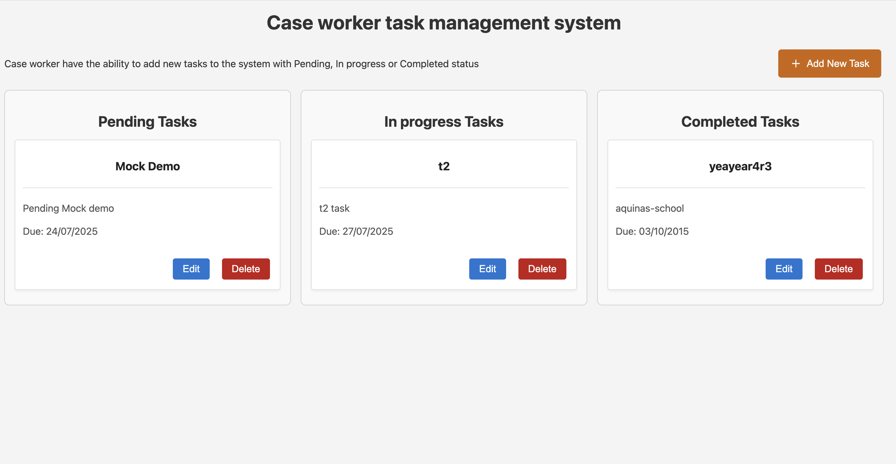

# React + TypeScript + Vite  installation and running instructions

Overview Case management system UI is a React TypeScript  application built with the latest version of React that demonstrates basic Task management functionality (CRUD). Developed by following a TDD strategy The application allows users to:

How it looks

Features

Responsive Design (For all the devices)
TDD
Type Safe

Functionalities Available

Create new Task

Delete a task

Upadate a task (Patch operation)

Get all the tasks

Prerequisites Before running the application, ensure you have:

Node.js (v16 or higher recommended)

npm or yarn package manager

Java JDK (for Spring Boot backend)

Running Spring Boot server (localhost:8081)  - CURRENTLY PROXIED FROM UI

Installation

git clone [repository-url] cd case-worker-task-management-system

Install dependencies: npm install

3.Running the Application Start your Spring Boot application: CD to the Task API App mvn spring-boot:run

** Note - **(Ensure it's running on http://localhost:8081) if not UI proxy (vite-config.js) has to be updated to point to correct server port

4.Start the React development server:

npm run dev

http://localhost:5173/

Operations - CRUD

To run all the test -   npm run test.

Happy coding.
